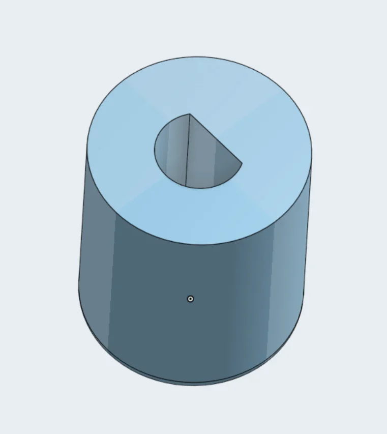
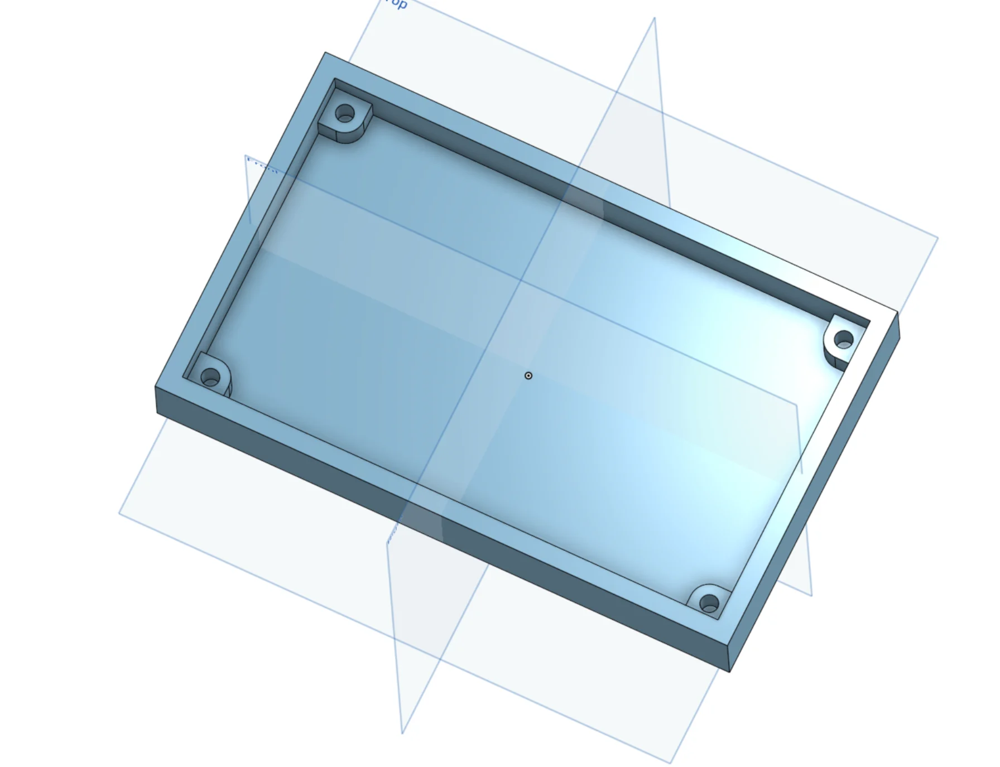
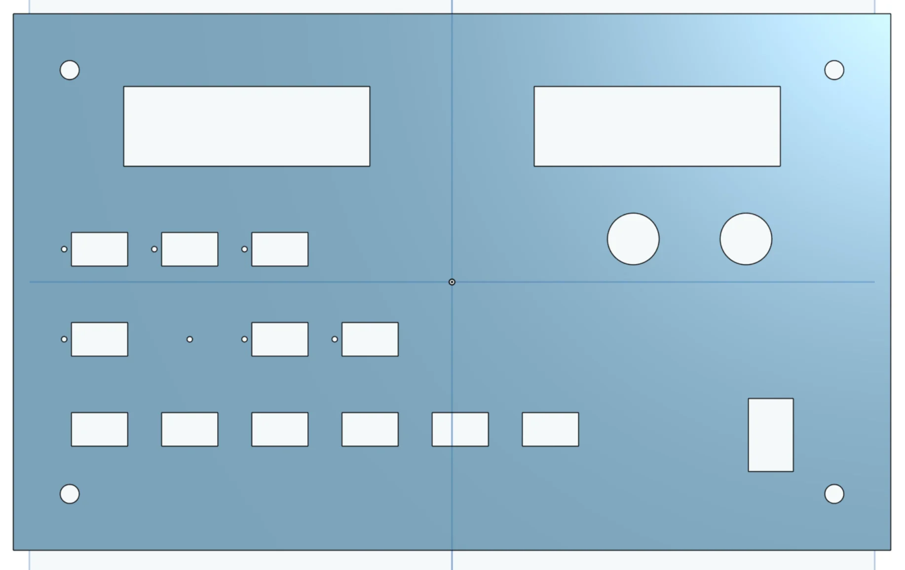
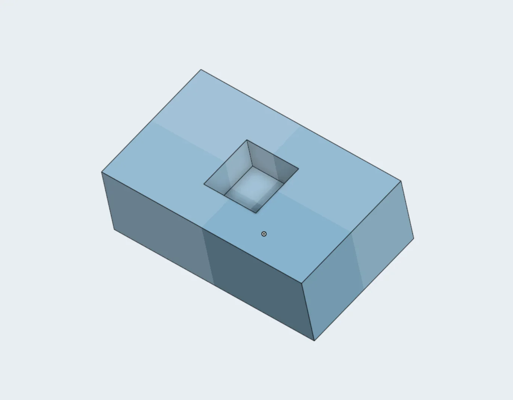
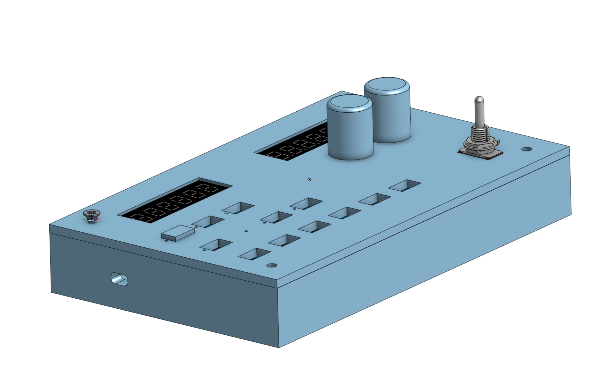
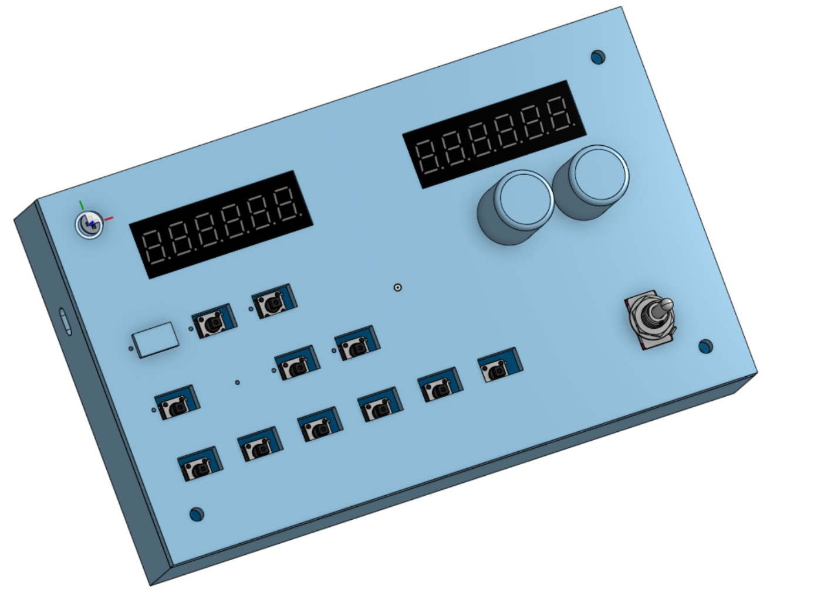
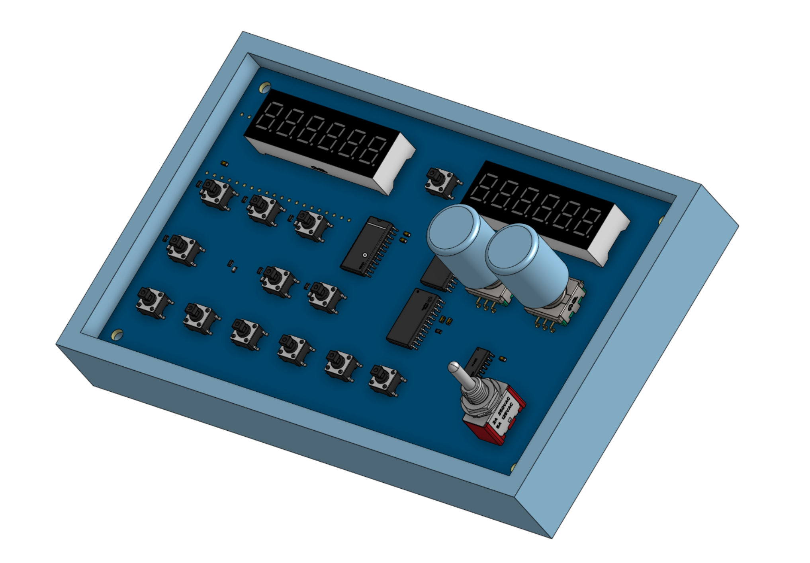

# A320RMP
## A320 Radio Management Panel
_Made for MSFS2020, MobiFlight, RP2040, and the FlyByWire A32NX_

### What is this?
The A320RMP is a small desktop radio management panel for use with Microsoft Flight Simulator and MobiFlight, and is based off the Raspberry Pi RP2040 platform.

### Why was this made?
While flying on VATSIM with MSFS2020, I realized it was very difficult to switch frequencies through the mouse and scroll wheel in the FlyByWire A32NX. So, here is my version of the A320 RMP.

## Pictures
### Schematic
`img/schematic.png`

### PCB Only
`img/pcb.png`

### CAD / Models
#### Knob
`img/knob.png` - `cad/knob.step`  
#### Case
`img/case.png` - `cad/case.step`  
#### Lid
`img/lid.png` - `cad/lid.step`  
#### Buttons
`img/button.png` - `cad/button.step`  
### Final Render
`img/final1.png`  
`img/final2.png`  
`img/final3.png`  

## BoM
WIP - Check Stasis

## A320RMP wouldn't be possible without:
* VATSIM, https://vatsim.net
* FlyByWire Simulations, https://flybywiresim.com
* Oakland vARTCC, https://oakartcc.org
* Hack Club, https://hackclub.com
* Stasis, https://stasis.hackclub,com
### And most importantly,
* @witherman3000, https://witherman3000.com

Thanks for looking through my project!
`5NN THX FER RPRT DE KO6LVM SK CL`